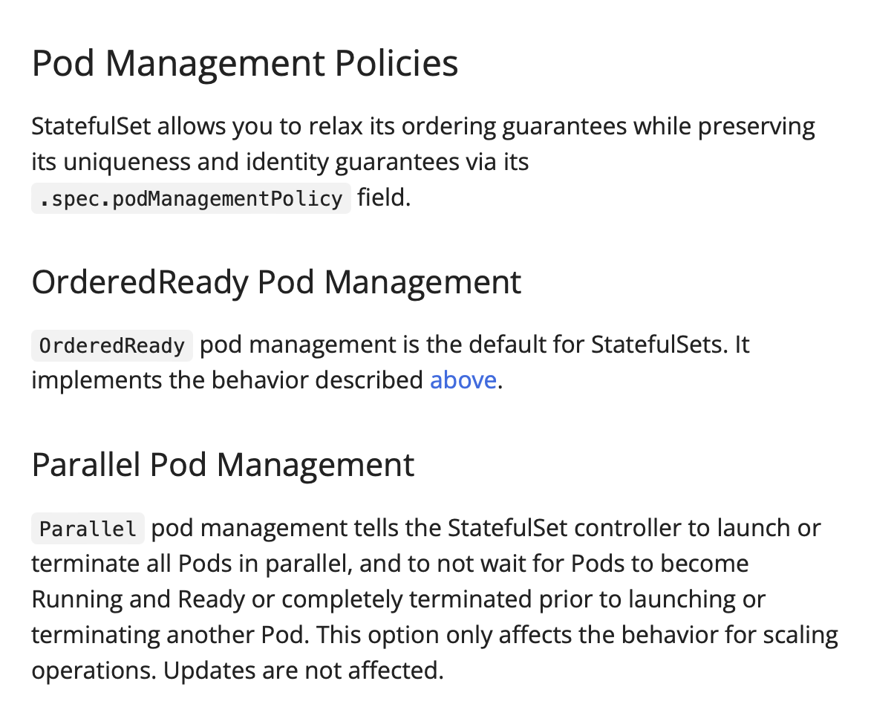

# danamit


## Kubernetes

### Pod Management Policies 


## Helm

### Apply
Helm Chart 的 global 設定區塊統一定義 extraEnv

- ❌ 但這寫法會錯！Helm 不允許在 values.yaml 裡用 template 語法。

```
global:
  extraEnv:
    - name: MY_ENV_VAR
      value: "my-value"

postgresql:
  extraEnvVars: {{ .Values.global.extraEnv }}

pgpool:
  extraEnvVars: {{ .Values.global.extraEnv }}
```

- ✅ 正確做法：修改 templates/deployment.yaml 中的 template 檔案
```
global:
  extraEnv:
    - name: MY_ENV_VAR
      value: "my-value"

postgresql:
  extraEnvVarsFromGlobal: true

pgpool:
  extraEnvVarsFromGlobal: true
```

FROM
```
{{- with .Values.postgresql.extraEnvVars }}
env:
  {{- toYaml . | nindent 12 }}
{{- end }}
```
TO
```
env:
  {{- if .Values.postgresql.extraEnvVars }}
  {{- toYaml .Values.postgresql.extraEnvVars | nindent 12 }}
  {{- end }}
  {{- if and .Values.global.extraEnv .Values.postgresql.extraEnvVarsFromGlobal }}
  {{- toYaml .Values.global.extraEnv | nindent 12 }}
  {{- end }}
```